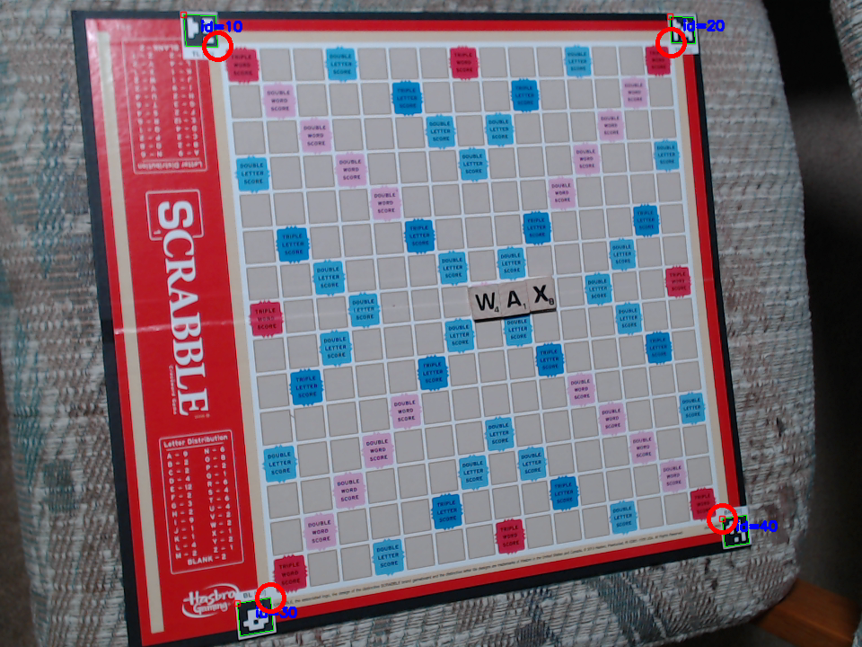
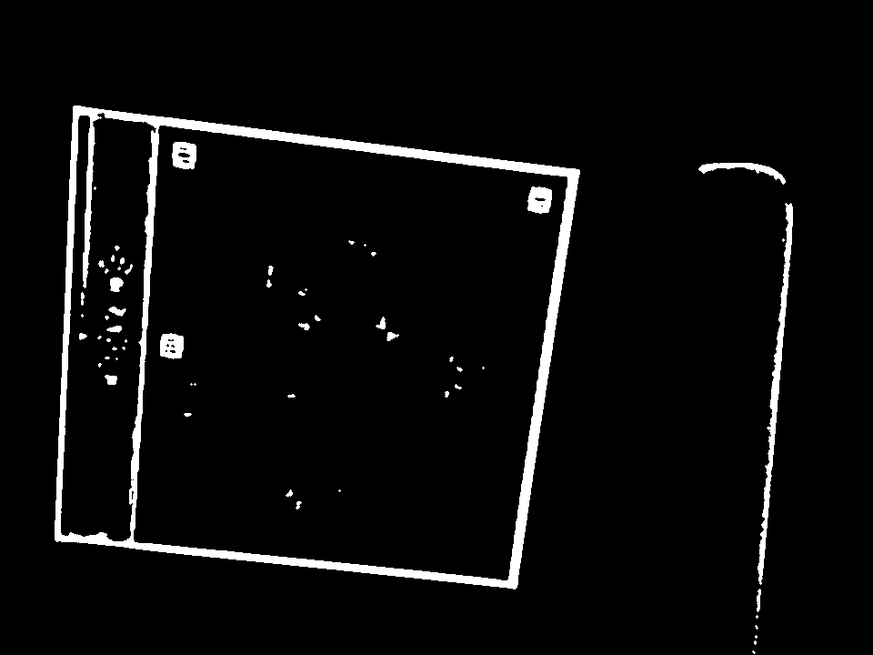
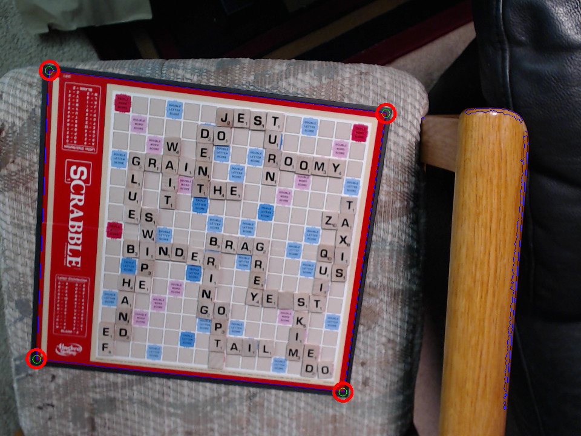
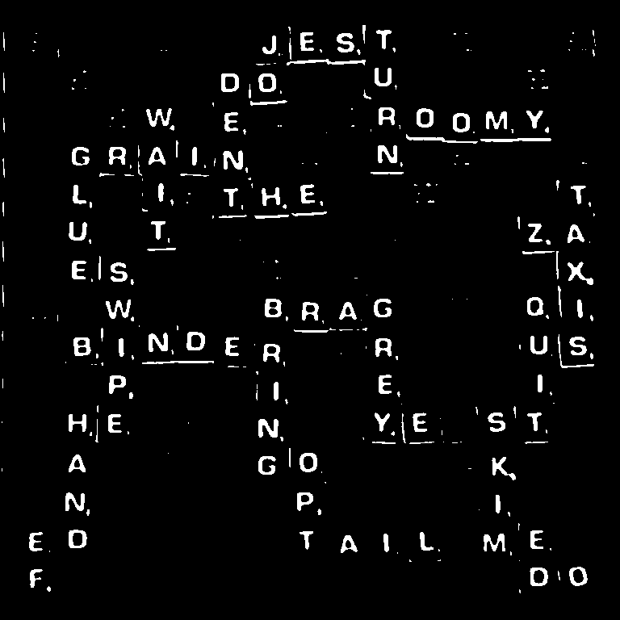
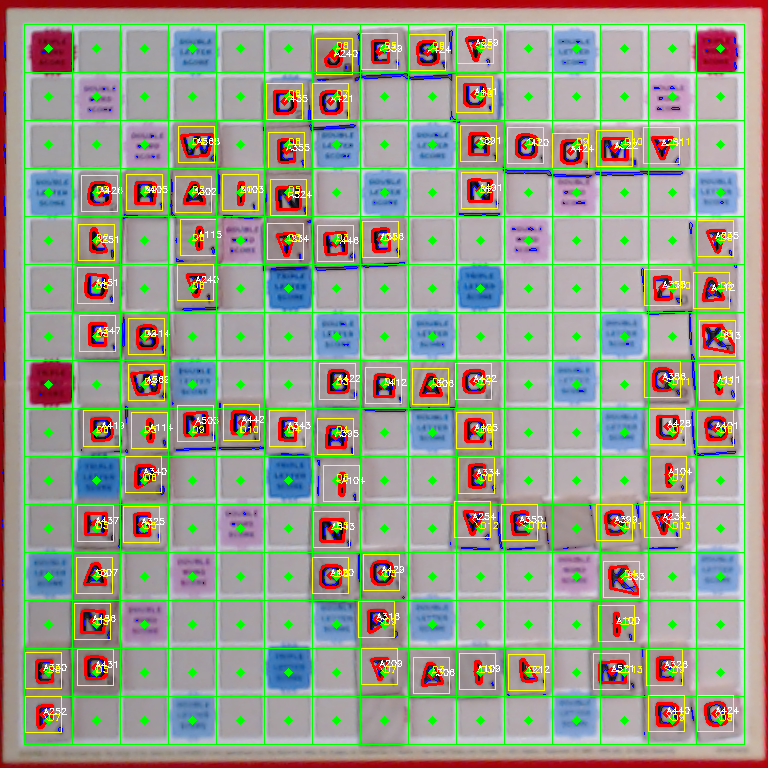
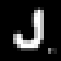
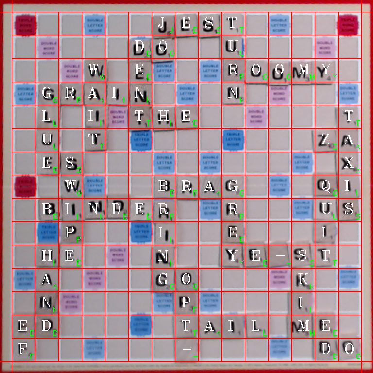
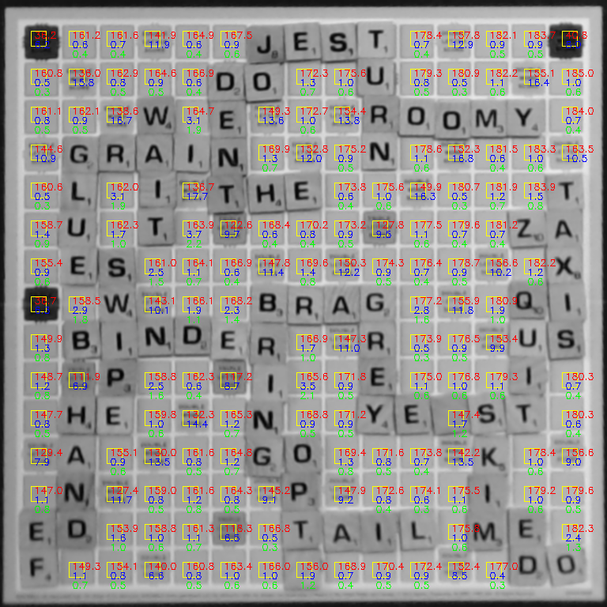
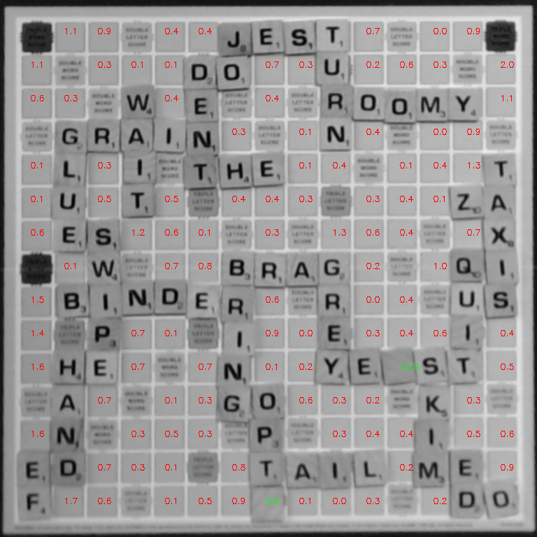
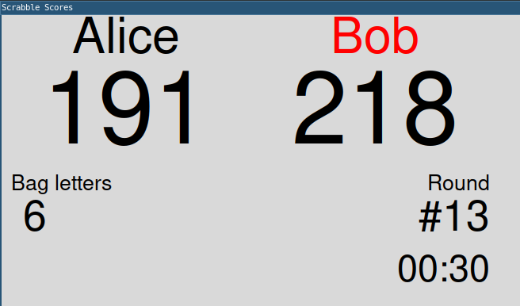

# scrabble-opencv

A fun computer vision Scrabble score-keeper using OpenCV and Python.

## Overview

I started this project around 2013 and I've been using it in family scrabble
games since then. Using a laptop plus a webcam, this program will read the
current board state and keep score automatically.

Video here: https://www.youtube.com/watch?v=BifKkBBQfZI (shows older version with worse performance)

This code is in somewhat rough shape and it will likely require some tuning to
get it to work using different cameras and lighting conditions. See `configs.py`
for the options that can be changed. This config file is continuously reloaded
so options here can be changed on-the-fly. The `DEBUG` boolean options will
enable more debug output views which will assist in the tuning.

I am using a Logitech C920 webcam but other sources will likely work fine.

## Getting Started

This project has been developed and tested under Ubuntu 22.04 LTS.

1) Install python and virtualenv: `sudo apt install python3-pip python3-venv`
1) Fetch this repository: `git clone https://github.com/jheidel/scrabble-opencv.git`
1) `cd scrabble-opencv`
1) `./setup.sh` to configure the virtualenv and install the needed libraries
1) `./start.sh` to run

You will need to make edits to `configs.py` to tune the detection for your
specific camera, lighting, and Scrabble board.

Edits might also be needed to `source.py` to select the appropriate capture
device.

TODO(jheidel): Improve video capture device selection.

## Vision Processing Methodology

Vision processing is done using [OpenCV](https://opencv.org/) running under Python 3.

### Corner Detection

As a first step, we must identify the position of the Scrabble board in the
captured image. This program supports two methods of doing this:

1) (Most reliable) [ArUco fiducial markers](https://docs.opencv.org/4.x/d5/dae/tutorial_aruco_detection.html) on each corner
1) Some Scrabble boards have a red boarder which is fairly easy to detect
1) You can place red circular stickers near the corners of the board as markers

The detection mode is configurable in `configs.py`.

The easiest and most reliable method is to use **corner markers**. Print out
[`corner_markers.pdf`](corner_markers.pdf) and apply these labels to the
corresponding corners. OpenCV has built-in detection for these ArUco markers
and it works extremely well.

In the case of **red border segmentation**, it looks as follows:

As a first step, we perform binary segmentation of the image to look for the red color:

Next, we look for large external contours and find one that has appropriate
shape and size (within configured thresholds). From this contour, we draw a
bounding polygon and extract the corners:

An offset is used to position the board relative to the corners (see the `_X`,
`_Y` adjustments in `configs.py`) and a perspective warp is performed in order
to isolate an undistorted image of the board for further processing. 

### Letter Detection

As a next step, we need to identify the positions on the board that contain a
letter. The board is first segmented using adaptive thresholding on the V
channel of HSV (looking for dark characters). This produces a binary
segmentation as follows:

From this, we detect contours and perform some post-processing to reject invalid contours:

 - contours must be within aspect ratio limits
 - contours must be within area limits (appropriate size)
 - contours must be within a fixed distance from a grid position (maximum letter shift)

From this, we select the nearest contour to each grid position and consider the
letter to be located at the center of that contour. This method allows for
letters to be misaligned slightly without affecting detection reliability.

### Letter Classification

Once we've identified all the locations on the board that contain a letter, we
need to classify those pixels as actual alphabet letters.

This is done using a simple K-Nearest neighbor ML model.

Each binary threshold letter is scaled to a 18x18 square:

This 18x18 image is turned into a 1D vector and fed directly into the model
which has been trained on samples of all scrabble letters. After evaluating all
letters against the model, we have a fully classified Scrabble board:

Letter averaging is done to improve detection reliability. The most common
letter seen in the last N frames is used.

### Blank Detection

Unfortunately it's not enough to simply classsify the black letters. Scrabble
also has blank tiles which can represent any letter. These blanks present a
machine vision challenge since they are very similar to background tiles on the
board.

As a first step, we convert the image to grayscale and then examine a small
patch from each tile in the board that is not yet classified as a letter. For
each patch, we compute an average color value and standard deviation. In the
image below, red represents the average, blue represents the standard
deviation, and green represents the coefficient of variance:

Blank tiles will have a low coefficient of variance (smooth color) and so we
reject anything above a configured threshold. These remaining tiles (green
letters in the image above) may either represent a blank letter tile, or a
blank background tile.

As a next step, we compare the average colors of each patch with that of its
possible blank neighbors. The difference is presented as a Z score. Any actual
blank letter tile will have a color that is slightly different than that of the
board background tiles and so will be an outlier. We consider a tile a blank
letter tile if it has a Z score above a configured threshold.

## Scoreboard

The program contains a rudimentary GTK app for a scoreboard:

The app will keep score for players. `espeak` is used in order to synthesize a
voice which announces how many points were achieved on each turn.

## Disclaimer

Scrabble is trademark of [Hasbro](https://en.wikipedia.org/wiki/Hasbro). This
software is purely a hobby project which is intended as Fair Use.
